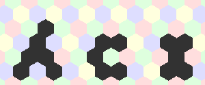

# hexcoord

[](https://goreportcard.com/report/github.com/erinpentecost/hexcoord)
[](https://travis-ci.org/erinpentecost/hexcoord.svg?branch=master)
[](https://godoc.org/github.com/erinpentecost/hexcoord)



hexcoord is a Go implementation of hexagonal grid math based on amitp's *Hexagonal Grids* articles. This package focuses on hexagonal grid math, including:

* Generating sets of hexes programmatically in common patterns.
* Compositing sets of hexes with unions, intersections, and subtractions (constructive solid geometry).
* Multithreaded A* pathing in a hex grid.
* Fast intersection testing.
* Super naive [drawing package](examples/drawhx)! This isn't performant; it's to help you visualize what's going on.

```go
import (
    // Base library
    "github.com/erinpentecost/hexcoord/pos"
    // For pathfinding
    "github.com/erinpentecost/hexcoord/path"
    // For constructive solid geometry
    "github.com/erinpentecost/hexcoord/csg"
)
```


## References

* [Hexagonal Grids](https://www.redblobgames.com/grids/hexagons)
* [Implementation of Hex Grids](https://www.redblobgames.com/grids/hexagons/implementation.html)
* [Priority Queue](https://golang.org/pkg/container/heap/#example__priorityQueue)
* [Constructive solid geometry (CSG)](https://en.wikipedia.org/wiki/Constructive_solid_geometry)
* [GLTF](https://github.com/KhronosGroup/glTF/blob/master/specification/2.0/README.md#meshes)
* [More GLTF](https://github.com/KhronosGroup/glTF-Tutorials/blob/master/gltfTutorial/gltfTutorial_005_BuffersBufferViewsAccessors.md)